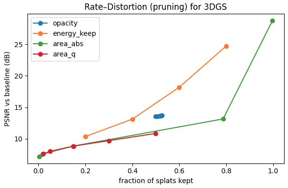
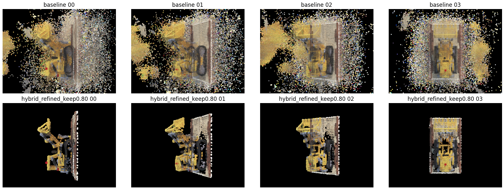

# Hybrid Pruning for 3D Gaussian Splatting (3DGS)

Practical framework to **prune** 3D Gaussian Splatting scenes using a **hybrid ranking signal** (SH energy, multi-view projected area, visibility, local density) with robust normalization and simple post-cleanup. Goal: **sharply reduce size** while **preserving visual quality**.

> 📄 Full write-up: see [`docs/HybridPruningFramework.pdf`](docs/HybridPruningFramework.pdf)
> Colab Link: https://colab.research.google.com/drive/1-OYCbrE-18xsFSiuIOw00DeE2TUTcvyO?usp=sharing

---

## Why

Single-signal pruning (e.g., opacity or area only) often:
- keeps background blobs (“floaters”),
- over-smooths edges / thin structures,
- or collapses texture detail.

A fused ranking is more stable across scenes and viewpoints.

---

## Features

- **Signals used per splat**
  - **SH Energy** (DC + higher orders, sigmoid-linearized)
  - **Projected Area (multi-view)** via camera intrinsics & per-axis scale projection
  - **Visibility proxy** (depth-aware footprint)
  - **Local Density** (kNN in splat space)
- **Experiments**: opacity/energy/area baselines vs **Hybrid**
- **Outputs**: pruned PLY, rate–distortion plots (PSNR vs kept fraction), qualitative comparisons, point-cloud previews

---

## Quickstart (Colab-friendly)

This project was developed in **Google Colab**.

**Dependencies (installed in code):**
plyfile lpips==0.1.4 imageio matplotlib tqdm scikit-learn plotly

**Steps:**
1. Upload your 3DGS **scene PLY** (standard 3DGS fields: `x,y,z`, `opacity`, `scales`, `rot` (quaternion), `f_dc_*`, `f_rest`).
2. Open `code/HybridPruning.ipnyb` in Colab and set:
   - `SCENE_PLY` → path to your PLY  
   - `OUTPUT_DIR` → an output folder
3. Run all cells. It will:
   - compute per-splat signals,
   - run a set of pruning baselines + the **Hybrid** method,
   - save pruned PLYs and evaluation artifacts.

**Key outputs saved to `OUTPUT_DIR/`:**
- `rd_curve.png` – rate–distortion (PSNR vs kept fraction)
- `pointcloud_preview.png` – quick 3D scatter preview
- `results.csv` – per-experiment metrics
- `*_pruned.ply` – pruned scene files

---

## Results (sample)

Comparison of **single-signal** pruning vs **Hybrid** (example scene):

| Method           | Kept Fraction | PSNR↑ (dB) | Visual notes                                  |
|------------------|---------------|------------|-----------------------------------------------|
| Opacity (0.20)   | 0.51          | 13.6       | severe detail loss; thin parts vanish         |
| Energy (0.60)    | 0.60          | 18.2       | textures washed out                           |
| Area (quantile)  | 0.79          | 13.2       | background blobs remain                       |
| **Hybrid (0.40)**| **0.42**      | **27.1**   | floaters removed; sharp geometry preserved    |
| **Hybrid (0.60)**| **0.61**      | **29.4**   | near-baseline fidelity, much smaller footprint|

Qualitative comparison (top: baseline, bottom: Hybrid ):  

For methodology, ablations, and limitations, see the PDF:  
[`docs/HybridPruningFramework.pdf`](docs/HybridPruningFramework.pdf)

---

## Project structure

---

## Notes & Limitations

- Visibility & area rely on provided camera intrinsics/poses; if unavailable, the code falls back to safe defaults and still produces **energy/density**-based pruning.  
- For reproducible RD numbers across scenes, keep the **same hyperparameters** and view grids.

---

## Roadmap (next steps)

- Optional CLI (`argparse`) to run outside Colab.  
- Ablation per signal (energy/area/visibility/density).  
- Bitrate reporting (MB on disk) with pruned PLY compression.  
- Cross-scene evaluation harness (3+ public scenes, shared config).

---

## License

MIT

